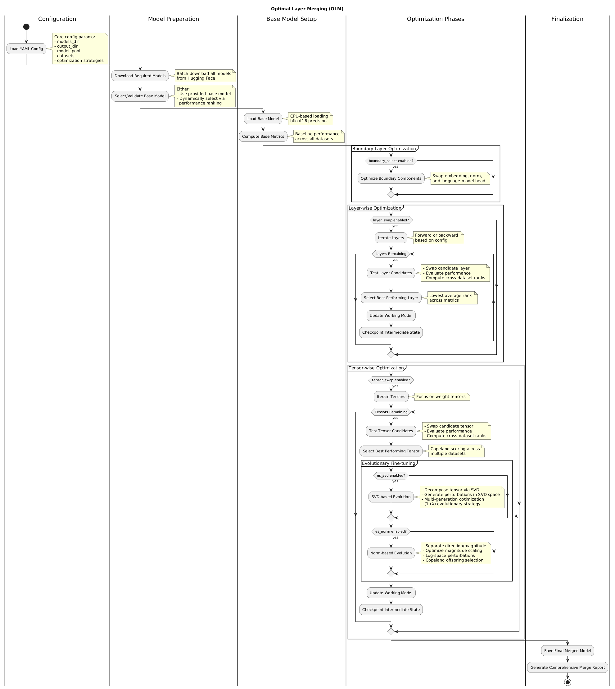

# olm.py Description

This Optimal Layer Merging (OLM) framework creates language models by strategically combining components from a pool of existing pre-trained models. It further refines these merged components using evolutionary strategies ((1+λ)-ES) for fine-tuning at the tensor level without computing gradients or using backpropagation.

## 1. Configuration and Setup

-   **Imports**: Imports necessary libraries including `torch`, `transformers`, `huggingface_hub`, `numpy`, `json`, `yaml`, `logging`, `argparse`, etc., for model handling, evaluation, data processing, and execution control.
-   **Logging**: Sets up basic logging to track the script's progress, key decisions, and any errors encountered.

## 2. Model and Dataset Handling

-   **`get_model_from_merge_report`**: Reconstructs a merged model from a JSON merge report. This involves loading a base model and selectively replacing its boundary components (embedding, final norm, LM head) and individual layers with components from other models as specified in the report.
-   **`download_model`**: Downloads a pre-trained model from the Hugging Face Hub if it's not already available locally in the specified `models_dir`.
-   **`load_model`**: Loads a pre-trained language model and its tokenizer from a local directory using `AutoModelForCausalLM.from_pretrained` and `AutoTokenizer.from_pretrained`, typically loading to CPU with `bfloat16` for memory efficiency.
-   **`get_datasets`**: Loads datasets from JSON files specified in the configuration. Each dataset includes its data and the designated evaluation `mode`.
-   **`get_evaluation_cache`**: Pre-computes and caches tokenized inputs (context, expected responses) for datasets to speed up repeated evaluations during optimization.

## 3. Evaluation Metrics

-   **`get_context`**: Formats the conversation history into a prompt string suitable for the model.
-   **`compute_response_diversity`**: Computes diversity of model responses, penalizing repetitive outputs and detecting Chinese character generation as a failure mode.
-   **`compute_bigram_loss`**: Evaluates model performance based on bigram probabilities using teacher forcing, computing a composite score of correctness and confidence.
-   **`compute_exact_match`**: Performs autoregressive exact match evaluation without teacher forcing, generating tokens incrementally and scoring based on prediction accuracy and confidence.
-   **`evaluate_model_on_dataset`**: Evaluates a model's performance on a given dataset using one of the defined evaluation modes (e.g., "diversity", "bigram_loss", "exact_match").

## 4. Layer and Tensor Operations

-   **`get_layer`**: Retrieves a specific layer (e.g., a transformer block) from a model.
-   **`replace_layer`**: Replaces a layer in the target model with a layer from a source model.
-   **`layer_sequence`**: Generates a sequence of layer indices (either forward or backward) for iteration.
-   **`get_last_layer_idx`**: Gets the index of the last optimized layer from a merge report.
-   **`get_layer_metrics`**: Retrieves performance metrics for a specific layer from a merge report.
-   **`_get_target_parameter_units`**: Identifies functional units of parameters (e.g., all weights and biases related to `q_proj` in a layer) for tensor-wise optimization.
-   **`calculate_full_svd`**: Computes the Singular Value Decomposition (U, S, Vh) of a tensor after normalization, with robust error handling for degenerate cases.
-   **`generate_noise_from_svd_coeffs`**: Generates multiplicative noise tensors by perturbing singular value coefficients in SVD space, applying inverse damping and exponential scaling for stable perturbations.

## 5. Merge Report, Ranking, and Selection

-   **`save_layer_state`**: Saves the current state of the working model and updates the merge report with metrics and the best model choice for the just-optimized layer.
-   **`save_tensor_state`**: Saves the model state and updates the merge report after tensor-wise optimization (including ES fine-tuning) for a parameter unit.
-   **`compute_model_ranks` / `compute_layer_ranks`**: Computes the rank of each candidate model (for a layer or tensor) based on its performance across multiple datasets, aggregating ranks to handle multi-objective optimization.
-   **`select_best_model`**: Selects the best candidate model using Copeland scoring (pairwise victories) to handle rank aggregation across multiple evaluation criteria.
-   **`select_component`**: A unified function to select the best base model, boundary layers, or layer-donor model based on rank aggregation across specified datasets and metrics.

## 6. Base Model Handling and Initialization

-   **`get_base_metrics`**: Evaluates the chosen base model on all datasets and saves these baseline metrics to the initial merge report. This involves copying base model files to the output directory.

## 7. Processing and Degradation Handling

-   **`process_model`**: Evaluates a candidate model (after a layer/tensor swap) on all datasets. It includes logic to detect performance degradation compared to established baselines (base model or previous best state) and can mark the candidate as unsuitable to save computation.

## 8. Boundary Layer Optimization

-   **`_apply_boundary_components`**: Helper function to apply `embed_tokens`, `model.norm`, and `lm_head` from a source model to the working model. The best source for these is determined by `select_component`.

## 9. Evolutionary Strategy ((1+λ)-ES) Fine-Tuning

The framework implements two complementary evolutionary strategies for gradient-free tensor optimization:

### SVD-Based Evolutionary Strategy
-   **`fine_tune_tensor_svd_es`**: Implements (1+λ)-ES optimization in SVD decomposition space.
    -   **SVD Decomposition**: Decomposes the target tensor using robust SVD with normalization and degeneracy handling.
    -   **Perturbation Generation**: Creates `λ` offspring by perturbing singular value coefficients with inverse damping (larger singular values receive proportionally smaller perturbations).
    -   **Noise Reconstruction**: Reconstructs multiplicative noise tensors through SVD components using exponential scaling with clamping for numerical stability.
    -   **Multi-Generation Evolution**: Iteratively refines tensors over multiple generations with adaptive sigma scaling and SVD recomputation.
    -   **Copeland Selection**: Uses pairwise comparison scoring to select optimal offspring across multiple evaluation criteria.

### Norm-Based Evolutionary Strategy  
-   **`fine_tune_tensor_norm_es`**: Implements (1+λ)-ES optimization by separating tensor direction and magnitude components.
    -   **Direction-Magnitude Decomposition**: Separates tensors into unit direction vectors and magnitude norms for independent optimization.
    -   **Log-Space Perturbations**: Applies perturbations in log-magnitude space to ensure positivity constraints while enabling multiplicative scaling.
    -   **Elitist Evolution**: Maintains best-performing magnitude configurations across generations with adaptive step size decay.
    -   **Catastrophic Failure Recovery**: Includes robust error handling to restore previous states when perturbations cause evaluation failures.

### Common ES Features
-   **Memory Efficiency**: Forward-pass only evaluation without gradient computation, suitable for consumer hardware.
-   **Multi-Objective Optimization**: Handles multiple datasets and evaluation metrics simultaneously through rank aggregation.
-   **Adaptive Parameters**: Dynamic adjustment of population size (λ ≈ 4 + 3×log(dimensions)) and mutation strength based on tensor characteristics.

## 10. Optimization Functions

-   **`layer_wise_optimization`**: Implements layer-wise optimization. It iterates through each layer of the working model, tests layers from all models in the pool, selects the best-performing one using rank aggregation, and applies it.
-   **`tensor_wise_optimization`**: Implements tensor-wise (or parameter unit-wise) optimization. It iterates through identified parameter units, tests corresponding units from the model pool, selects the best one by rank, applies it, and then **optionally refines the newly applied unit using both SVD-based and norm-based evolutionary strategies** based on configuration flags (`es_svd`, `es_norm`).

## 11. Main OLM Function

-   **`olm`**: The main orchestrator function.
    -   Loads configuration and datasets.
    -   Handles model downloading and selection of the initial base model.
    -   Builds an evaluation cache.
    -   Initializes or loads a `merge_report.json`.
    -   Establishes base model metrics.
    -   Optionally performs boundary layer optimization.
    -   Optionally performs layer-wise optimization.
    -   Optionally performs tensor-wise optimization (which includes ES fine-tuning).
    -   Saves the final optimized model and the comprehensive merge report.

## 12. Main Execution

-   **`main`**: The script's entry point. Parses command-line arguments (path to config YAML, optional path to an existing merge report to resume/extend from), loads the configuration, and invokes the `olm` function.

## Key Concepts

-   **Layer Merging**: Strategically replacing entire layers in a base model with layers from a pool of candidate models.
-   **Tensor Merging (Parameter Unit Merging)**: Replacing specific groups of related weight tensors (functional units) within layers.
-   **Dual Evolutionary Strategies**: Two complementary (1+λ)-ES approaches for gradient-free tensor optimization:
    - **SVD-ES**: Optimizes in singular value decomposition space, respecting tensor's intrinsic mathematical structure
    - **Norm-ES**: Optimizes magnitude scaling while preserving learned directional features
-   **Merge Report**: A JSON file that meticulously records the entire merging and optimization process: base model, chosen boundary layers, source of each replaced layer/tensor, and performance metrics at each stage.
-   **Evaluation Metrics & Cache**: Custom functions (diversity, bigram loss, exact match) to assess model performance. An evaluation cache pre-processes data for faster repeated evaluations.
-   **Copeland Selection**: A robust tournament-style method for choosing the "best" component by aggregating pairwise victories across multiple datasets/metrics, handling multi-objective optimization without requiring metric weighting.
-   **Degradation Handling**: Mechanisms to prevent applying changes that worsen performance on critical metrics compared to established baselines.
-   **Boundary Layers**: The initial embedding layer, final normalization layer, and the language model head, which are optimized as a distinct functional unit.
-   **SVD-Guided Perturbation**: Using Singular Value Decomposition to mathematically principled noise generation, focusing perturbations on singular value coefficients with inverse damping for stability.
-   **Cascade Optimization**: Sequential application of optimization techniques (discrete component swapping → SVD-ES → norm-ES) for progressive refinement without interference between different optimization objectives.

The `olm_config.yaml` file provides the configuration settings for the script, specifying the model pool, datasets for evaluation, evaluation modes, optimization strategies to employ (boundary, layer, tensor, ES), and parameters controlling the merging and ES processes including generation counts, population sizes, and mutation strengths.
